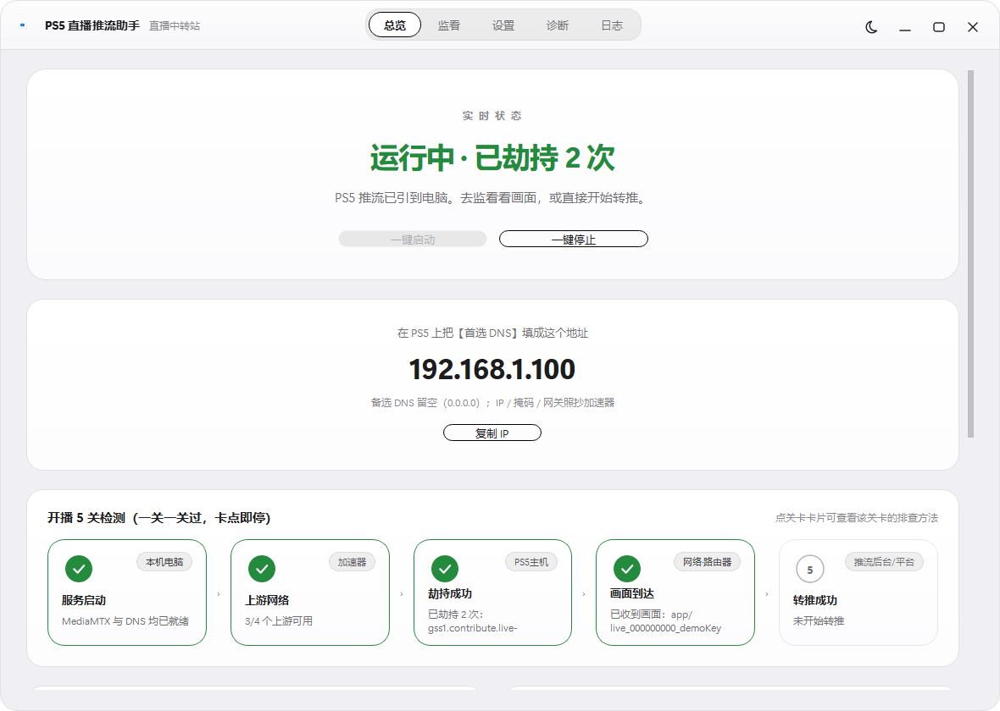
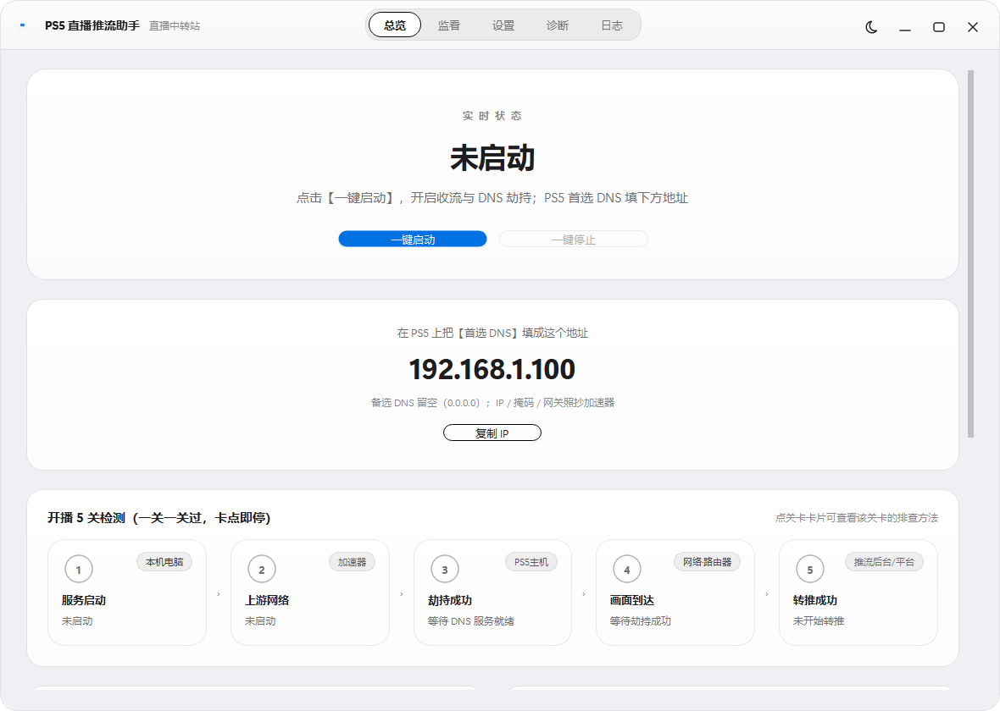
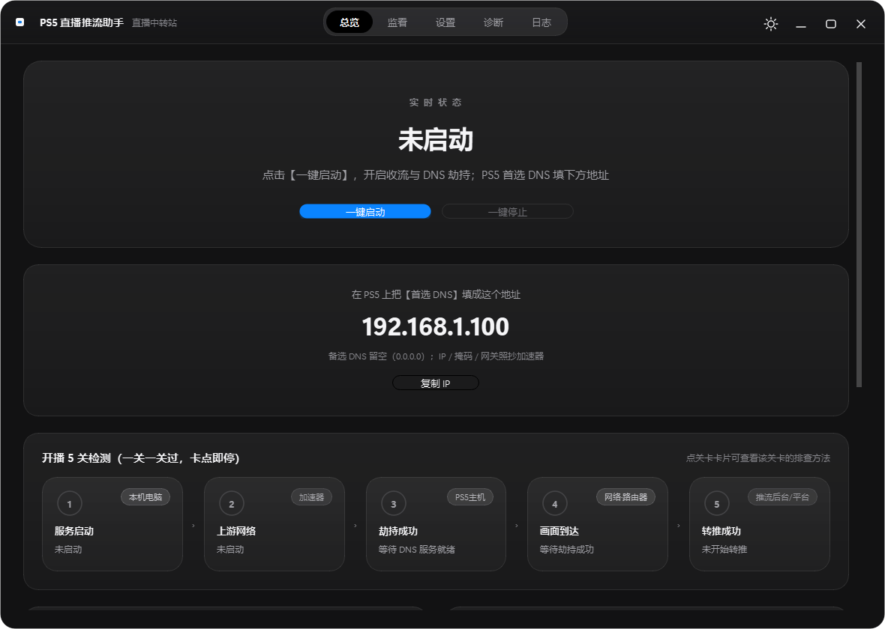
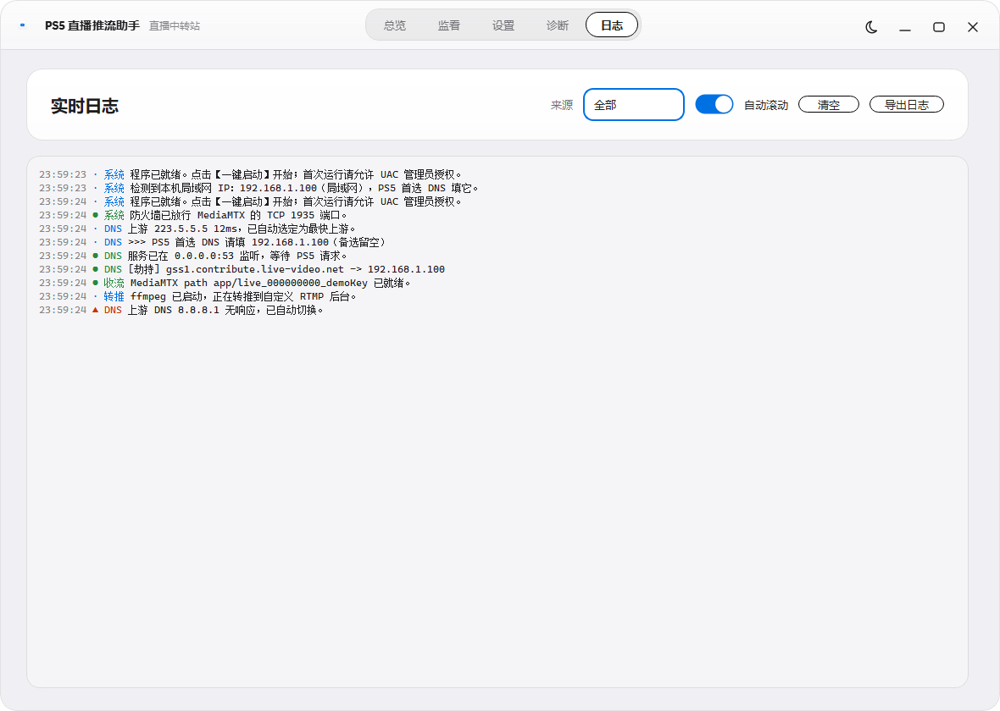
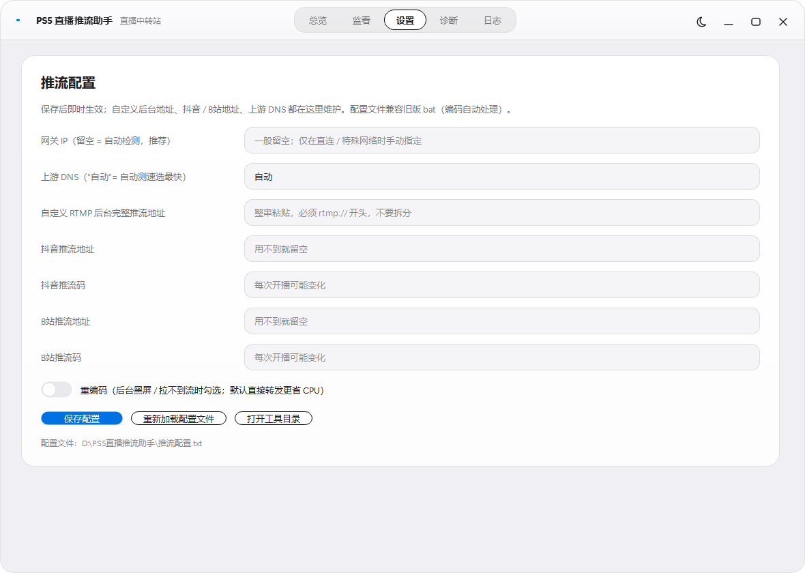
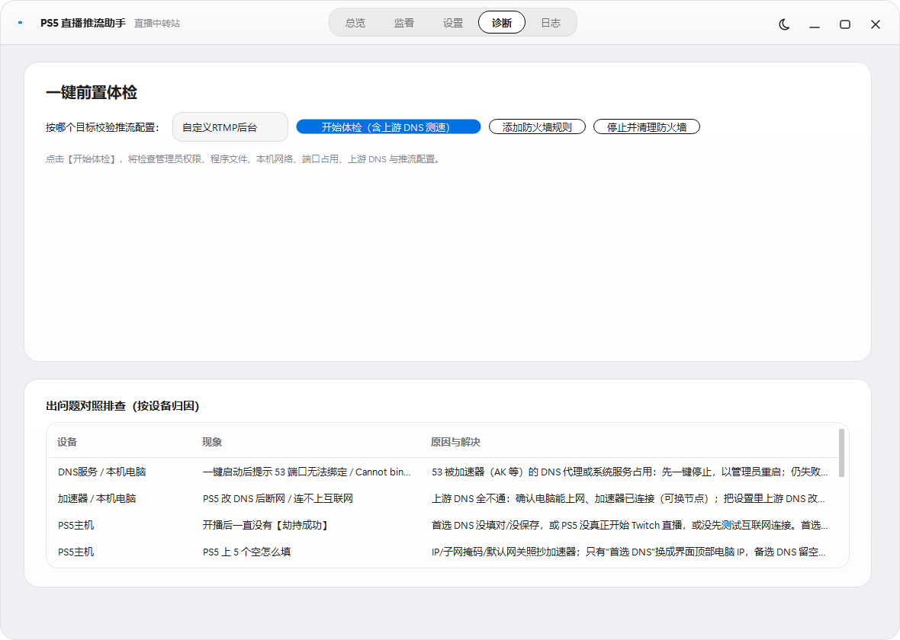
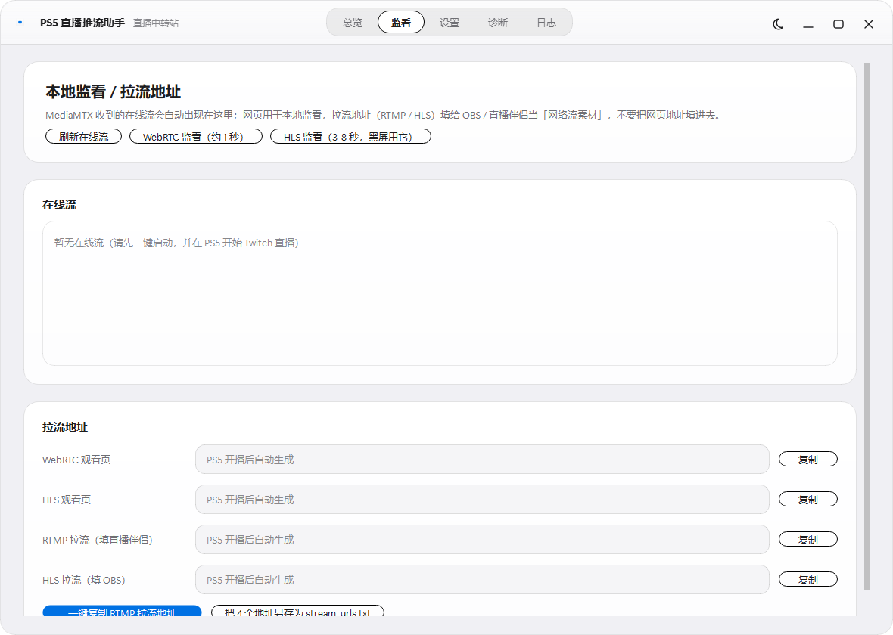

# PS5 直播推流助手

> **无采集卡 · 无 Remote Play** —— 把 PS5 的 Twitch 直播，经「DNS 劫持 → 本机收流 → ffmpeg 转推」转发到**抖音直播伴侣 / B站直播姬 / 任意 RTMP 后台**。

<p align="left">
  
  
  
  
</p>



---

## 目录

- [一、这是什么](#一这是什么)
- [二、它是怎么工作的](#二它是怎么工作的)
- [三、界面预览](#三界面预览)
- [四、快速开始（下载即用）](#四快速开始下载即用)
- [五、五关自检：一关一关过](#五五关自检一关一关过)
- [六、目录结构](#六目录结构)
- [七、从源码构建](#七从源码构建)
- [八、命令行版（可选）](#八命令行版可选)
- [九、常见问题排查](#九常见问题排查)
- [十、卸载与清理](#十卸载与清理)
- [十一、许可与致谢](#十一许可与致谢)

---

## 一、这是什么

PS5 自带直播只支持 **Twitch / YouTube**，想播到抖音或 B 站，通常需要**采集卡**或者 **PS Remote Play 投屏**——前者要花钱，后者画质被二次压缩、延迟还高。

这个工具换了个思路：**让 PS5 以为 Twitch 的推流服务器就是你自己的电脑**，于是它把原画质推流直接发到电脑上，电脑再转发到你想播的平台。

- ✅ **不用采集卡**，不用额外硬件
- ✅ **不用 Remote Play**，画质无损、不被二次压缩
- ✅ 一个窗口管到底：收流、DNS、转推、监看、诊断、日志
- ✅ **开播 5 关自检**：卡在哪一关、是哪个设备的问题，界面上直接告诉你
- ✅ 现代极简风格界面，白天 / 黑夜双主题

> ⚠️ **使用前提**：你需要一个**主机加速器**（网易 UU、迅游、AK 等任意一款）来让 PS5 走游戏加速通道，并让 PS5 能登录 Twitch。本工具不提供加速服务，也不包含任何账号。

---

## 二、它是怎么工作的

```
PS5 ──网线/WiFi──> 同一个路由器 <──WiFi── 电脑 (如 192.168.1.100)
                     │                          │
        普通域名(PSN/游戏)              Twitch 推流域名
        正常解析、走加速通道      *.live-video.net / live.twitch.tv
                                                   │
                                       被"DNS 劫持"改指向电脑
                                                   │
                                    MediaMTX :1935 接住原画质流
                                                   │
                                     ffmpeg 转推 → RTMP 后台
                                                   │
                                        抖音直播伴侣 / B站直播姬
```

一句话：**PS5 连的"首选 DNS"指向这台电脑，电脑只对 Twitch 的推流域名撒谎，把它们指向自己；其它域名照常转发到上游 DNS，所以 PS5 上网、联机一切正常。**

涉及的本地端口：

| 端口 | 协议 | 用途 |
|---|---|---|
| `53` | UDP + TCP | DNS 劫持服务（PS5 的首选 DNS 指向本机） |
| `1935` | TCP | MediaMTX 接收 PS5 推来的 RTMP 原始流 |
| `8888` | TCP | MediaMTX **HLS** 播放（兼容性最好、有声音，延迟 3–8 秒） |
| `8889` | TCP | MediaMTX **WebRTC** 播放（延迟约 1 秒，但浏览器不支持 PS5 的 AAC，有画无声） |
| `9997` | TCP | MediaMTX 状态接口（程序用它查在线流） |

> 只改「首选 DNS」这一个值，是整套方案能成立的关键——具体怎么填见 [第四节](#四快速开始下载即用)。

---

## 三、界面预览

| 总览（白天） | 总览（黑夜） |
|---|---|
|  |  |

| 实时日志 | 推流配置 |
|---|---|
|  |  |

| 一键前置体检 | 本地监看 / 拉流地址 |
|---|---|
|  |  |

---

## 四、快速开始（下载即用）

### 4.1 环境要求

| 项目 | 要求 |
|---|---|
| 系统 | Windows 10 / 11 |
| 网络 | PS5 与电脑连**同一个路由器**（同一 WiFi 或有线都行）；或 PS5 网线直连电脑 |
| 加速器 | 任一款主机加速器（必须先开，PS5 才能登 Twitch） |
| ffmpeg | **必须安装**，三选一：① 已在 `PATH` 中；② 放在程序目录的 `ffmpeg\ffmpeg.exe`；③ 放在 `bin\ffmpeg.exe`（程序会自动搜索） |
| 权限 | 首次运行需要点 UAC「是」（用于放行 53 / 1935 端口） |

### 4.2 开播五步

1. **双击 `release\PS5直播推流助手.exe`**，UAC 弹窗点「是」。
   （首次启动有约 2 秒启动动画，点任意处可立即进入。直接关窗口是**最小化到托盘**，退出请在托盘图标右键。）

2. **开加速器，填 PS5 的 DNS。**
   - 电脑上打开加速器，加速「PS5 主机」；
   - 程序「总览」页中间会显示 **`在 PS5 上把【首选 DNS】填成这个地址`**，点「复制 IP」；
   - PS5：`设置 → 网络 → 设定互联网网络 → 选当前网络 → 高级设置`，按下表填：

   | PS5 项目 | 填什么 |
   |---|---|
   | IP 地址 | **照抄加速器给的** |
   | 子网掩码 | **照抄加速器给的** |
   | 默认网关 | **照抄加速器给的** |
   | **首选 DNS** | **填程序里显示的那个 IP**（关键！不是加速器的 DNS） |
   | 备选 DNS | **留空**（0.0.0.0 或不填） |
   | MTU / 代理 | 保持自动 / 不使用 |

3. **回电脑点「一键启动」。** 顶部「开播 5 关检测」的第 ①② 关依次变绿。

4. **PS5 进游戏 → 按创建键 → 直播 → Twitch → 开始直播。**
   第 ③ 关「劫持成功」变绿即说明 PS5 的流已被引到电脑；第 ④ 关变绿说明画面已到达。
   想先看画面，点「打开 WebRTC 监看」（低延迟约 1 秒，有画无声；黑屏就换 HLS，有声但慢几秒）。

5. **填推流地址并开始转推。**
   - 「设置」页填好推流地址 —— 推荐用 **`自定义 RTMP 后台完整推流地址`**（整串 `rtmp://...` 直接粘贴，不要拆分），也可填抖音 / B站的地址 + 推流码，然后点「保存配置」；
   - 回到「总览」，在「转推到后台」卡片里选好目标平台，点 **「开始转推」**；
   - 第 ⑤ 关「转推成功」变绿、`frame` 数字持续增长 → 去**抖音直播伴侣 / B站直播姬点「开始直播」**，完成。

> **结束**：先在 PS5 上停止 Twitch 直播，再回电脑点「一键停止」。
> **想彻底清理**：见 [第十节](#十卸载与清理)。

---

## 五、五关自检：一关一关过

界面上「开播 5 关检测」把整条链路拆成 5 关，**每关都标出了负责的设备**，哪关不过就停在那关解决，不用往下猜：

| 关卡 | 负责设备 | 通过标志 |
|---|---|---|
| ① 服务启动 | 本机电脑 | MediaMTX 与 DNS 劫持均已就绪、防火墙已放行 |
| ② 上游网络 | 加速器 | 至少一个上游 DNS 可用（PS5 改完 DNS 后仍能上网） |
| ③ 劫持成功 | PS5 主机 | PS5 点「开始直播」后，出现 `[劫持] xxx.live-video.net -> 电脑IP` |
| ④ 画面到达 | 网络路由器 | 出现在线流 `app/xxxx`，监看能看到游戏画面 |
| ⑤ 转推成功 | 推流后台 / 平台 | ffmpeg `frame` 持续增长，后台确认有画面 |

任何一关出问题，「总览」页会用**红色叉号**标出卡点，并弹出**诊断卡**，按可能性排序告诉你「哪个设备 / 哪里出的问题、怎么处理」。
也可以到「诊断」页点 **「开始体检（含上游 DNS 测速）」** 做一次完整前置体检（管理员权限、程序文件、ffmpeg、网卡、53 / 1935 端口占用、上游 DNS、推流配置逐项检查）。

---

## 六、目录结构

```
PS5直播推流助手/
├── README.md                    ← 本文件
├── LICENSE                      ← MIT 许可证
├── .gitignore
│
├── release/                     ← 【下载即用】整个文件夹拷走就能跑
│   ├── PS5直播推流助手.exe       主程序（管理员权限，单文件）
│   ├── mediamtx/               本机收流服务 —— 必须与 EXE 同目录，勿删
│   ├── 推流配置.txt             推流地址等配置（空模板，也可在界面「设置」页填）
│   ├── 使用说明.txt             速查卡
│   └── PS5直播懒人教程.md        原理 + 排障详版
│
├── source/                      ← 【源码】
│   ├── README.md               源码说明
│   ├── requirements.txt        依赖清单
│   ├── *.py / *.bat / *.ps1    命令行版（无需图形界面）
│   └── gui_src/                图形界面版（PySide6）
│       ├── app.py              入口（启动动画 → 主窗口）
│       ├── core.py             路径解析 / 配置 / 网卡检测 / ffmpeg 查找
│       ├── theme.py            主题配色与 QSS（白天 / 黑夜）
│       ├── widgets.py          自绘控件（胶囊按钮、分段导航、开关、日志台…）
│       ├── main_window.py      主窗口与 5 个页面
│       ├── splash.py           启动动画
│       ├── dns_engine.py       DNS 劫持引擎
│       ├── workers.py          MediaMTX / ffmpeg 转推管理
│       ├── diagnostics.py      5 关状态机与诊断文案
│       ├── make_assets.py      生成图标与启动图（Pillow）
│       ├── build.py            一键打包脚本
│       └── assets/             图标 / 启动图
│
└── docs/
    ├── PS5直播懒人教程.md        完整教程（原理 / 五关 / DNS 窗口逐行对照 / 排障）
    └── screenshots/            界面截图
```

---

## 七、从源码构建

### 7.1 直接运行（开发态）

```bash
# 1) 装依赖
pip install -r source/requirements.txt

# 2) 运行图形界面
cd source/gui_src
python app.py
```

> 开发态下程序会在 `source/` 里找 `mediamtx\mediamtx.exe` 与 `推流配置.txt`。
> 想完整跑通收流，请把 `release/mediamtx/` 整个复制到 `source/` 下。

### 7.2 打包成单文件 EXE

```bash
cd source/gui_src
python build.py          # 或双击 / 执行 build.ps1
```

脚本会依次：用 Pillow 生成 `assets/app.ico`、`assets/splash.png` → 调 PyInstaller 打成单文件 → 把产物复制到 `source/` 根目录。
产物同时位于 `source/gui_src/dist/PS5直播推流助手.exe`。

> **注意**：PyInstaller 的 `--uac-admin` 会让 EXE 每次启动都请求管理员权限，因此**在未提权的情况下无法自测**，属正常现象。
> 打包好的 EXE 要能正常工作，需要与 `mediamtx\` 和 `推流配置.txt` 放在同一目录——最简单的做法是直接放进 `release\` 文件夹覆盖同名文件。

---

## 八、命令行版（可选）

`source/` 下保留了不依赖图形界面的批处理版，适合无人值守或二次开发：

| 文件 | 作用 |
|---|---|
| `①一键启动.bat` | 放行防火墙 + 启动 MediaMTX 与 DNS 劫持（需管理员） |
| `②转推RTMP后台.bat` | 转推到「自定义推流地址」（主线） |
| `②转推抖音.bat` / `②转推B站.bat` | 直接转推对应平台（备用） |
| `③一键停止.bat` | 停止全部服务 |
| `④监看画面.bat` / `④监看(兼容模式).bat` | 自动找流并打开播放页；拼好 RTMP / HLS 拉流地址（RTMP 自动复制到剪贴板） |
| `一键撤回.bat` | 删除防火墙规则、还原改动 |
| `推流配置.txt` | 与图形界面共用同一份配置 |

> 运行前请确认 `python` 或 `py` 在 `PATH` 中（脚本会自动选择），并已 `pip install dnslib`。
> 命令行版需要把 `mediamtx\` 放在同一目录；详细流程见 `docs/PS5直播懒人教程.md`。

---

## 九、常见问题排查

| 现象 | 原因与解决 |
|---|---|
| **第 2 关：PS5 改 DNS 后断网 / 连不上互联网** | ① 首选 DNS 填成了网关（如 `192.168.1.1`）或加速器给的 DNS —— 必须填程序显示的那个电脑 IP；② 备选 DNS 没清空；③ 上游 DNS 全不通：确认电脑本身能上网，把配置里 `上游DNS=自动` 改为 `上游DNS=8.8.8.1` 后重开；④ 确认 PS5 与电脑连的是同一台路由器 |
| **提示 53 端口无法绑定 / 被占用** | 多为加速器的 DNS 接管占用。先「一键停止」，再以**管理员身份**重启程序；仍不行则在加速器设置里关闭它的 DNS 代理 |
| **第 3 关一直不过，没有 `[劫持]`** | PS5 首选 DNS 没填对 / 没保存；或 PS5 并未真正开始 Twitch 直播；先回第 2 关确认 PS5 能正常上网 |
| **第 4 关不过 / 监看黑屏** | 说明劫持没成功，画面没到电脑 —— 先解决第 3 关 |
| **转推窗口一直"还没收到 PS5 流"** | PS5 没开播，或没有出现 `[劫持]` 行 |
| **ffmpeg 在跑但后台黑屏** | 打开 `推流配置.txt`，把 `重编码=否` 改成 `重编码=是`（牺牲 CPU 换兼容性），保存后重新转推 |
| **WebRTC 监看有画无声** | 正常现象：浏览器 WebRTC 不支持 PS5 的 AAC 音频。改用 **HLS 监看**即可有声 |
| **换了加速器 / 换了 WiFi 后失效** | 电脑局域网 IP 变了。重开程序，看「总览」页新的 IP，把 PS5 首选 DNS 改成新值 |
| **启动动画一直不消失** | 程序文件不完整 —— 确认 `mediamtx\` 文件夹与 EXE 在同一目录 |
| **重复双击没反应** | 程序已做单实例保护（多实例会抢 53 / 1935 端口），请在系统托盘找回窗口 |

更多细节（含 DNS 英文窗口逐行中文对照）见 [`docs/PS5直播懒人教程.md`](docs/PS5直播懒人教程.md)。

---

## 十、卸载与清理

1. 在程序里点「一键停止」（或双击 `③一键停止.bat`）；
2. 点「诊断」页的 **「停止并清理防火墙」**（或双击 `一键撤回.bat`）删除本工具添加的 3 条防火墙规则；
3. 直接删除整个文件夹即可 —— 程序为**单文件封装，不写注册表**，系统不留残留。
4. **记得把 PS5 的 DNS 改回去**：`设置 → 网络 → 高级设置 → DNS`，首选 DNS 改回加速器给的地址或「自动获取」。

> 程序运行时产生的 `stream_urls.txt` 只记录本机 `127.0.0.1` 的临时拉流地址（含会话随机串），已加入 `.gitignore`，**请勿提交到仓库**。

---

## 十一、许可与致谢

本项目以 **MIT License** 发布，详见 [`LICENSE`](LICENSE)。Copyright (c) 2026 dachengzi6661。

内置 / 依赖的第三方组件：

| 组件 | 用途 | 许可 |
|---|---|---|
| [MediaMTX](https://github.com/bluenviron/mediamtx) | 本机 RTMP 收流与 HLS / WebRTC 播放 | MIT |
| [dnslib](https://github.com/paulc/dnslib) | 纯 Python DNS 服务与报文构造 | BSD-2-Clause |
| [PySide6 / Qt 6](https://www.qt.io/) | 图形界面框架 | LGPL-3.0 |
| [PyInstaller](https://pyinstaller.org/) | 打包为单文件 EXE | GPL-2.0（含例外，不影响本程序分发） |
| [FFmpeg](https://ffmpeg.org/) | 转推编码（需用户自行安装） | LGPL / GPL |

> 本项目仅供个人学习与自用直播。请遵守 Twitch、抖音、B站等平台的服务条款与当地法律法规，不要用于任何侵权或违规用途。
> 工具不破解、不绕过任何平台的账号体系，也不包含任何加速服务。

---

## English

**PS5 Live Streaming Relay** — Stream your PS5 gameplay to Douyin / Bilibili / any RTMP backend **without a capture card**.

It works by hijacking the DNS resolution of Twitch's ingest domains (`*.live-video.net`, `live.twitch.tv`) on your local machine and redirecting them to a local MediaMTX instance, which receives the PS5's original RTMP stream and re-publishes it via ffmpeg. Point your PS5's *primary DNS* at the PC — everything else resolves normally.

- Windows 10/11 · Python 3.10+ · PySide6 (Qt6) UI
- Requires: a console gaming accelerator (for the PS5 to reach Twitch) and `ffmpeg`
- Download-and-run build: [`release/`](release/) · Source: [`source/`](source/) · Docs: [`docs/`](docs/)
- Licensed under the [MIT License](LICENSE)
